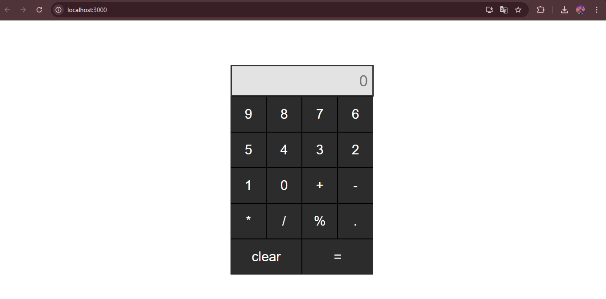
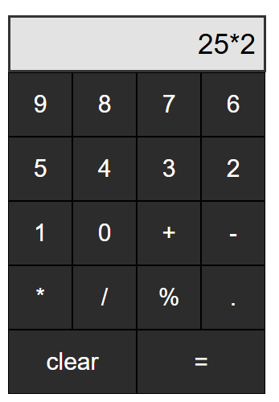
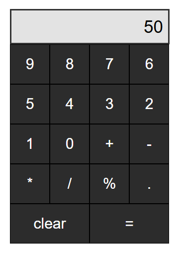
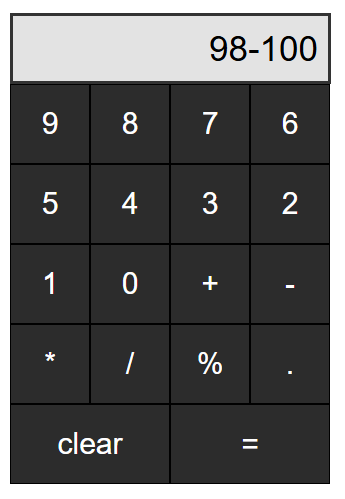
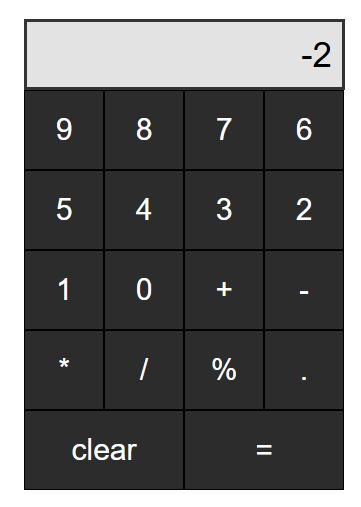
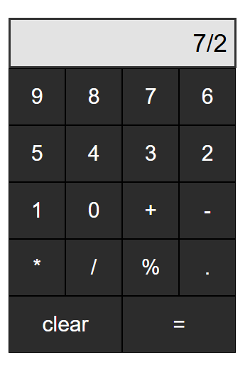
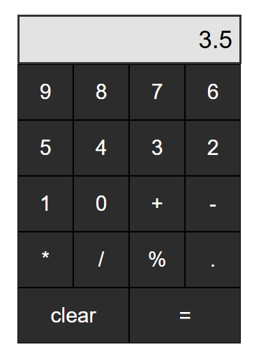
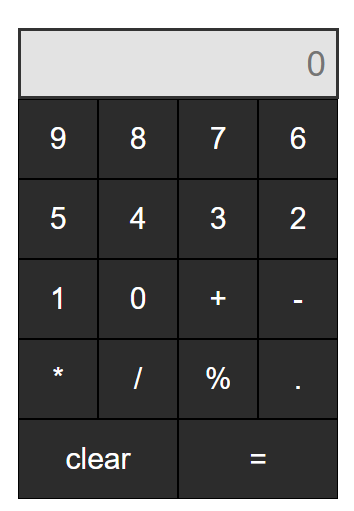

#Title : calculator-react 

#Descripton : This is a small fit calculator project with React JS

#Technologies used : React JS and CSS 

#Screenshots

#To install the application :

  1- git clone https://github.com/mhmdsanou/calculator-react.git
  
  2- cd calculator-react
  
  3- npm install
  
  4- npm start
